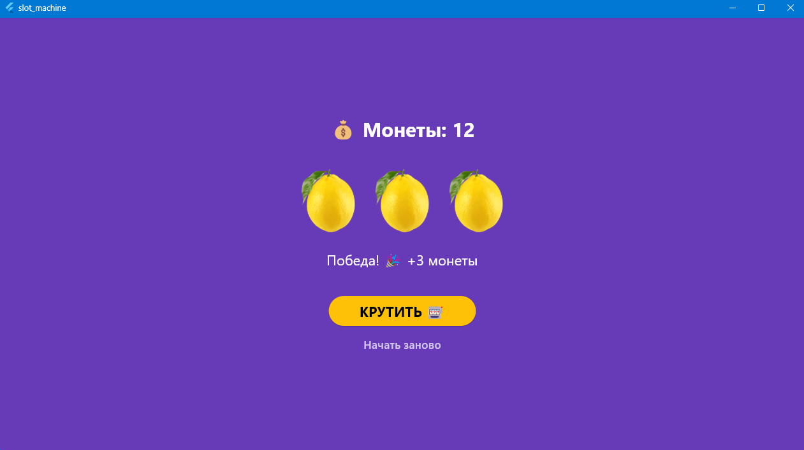

# Лабораторная работа №6. Flutter: StatefulWidget и управление состоянием

ФИО: Горбачева Маргарита

Группа: ИСП-231

#### Что изучили

 - изучили разницу между StatelessWidget и StatefulWidget, 

- научились управлять состоянием приложения через setState(),

- научились подключать локальные изображения и обрабатывать нажатия кнопок — на примере слот-машины.

#### Скриншот финального приложения:

#### Инструкция по запуску

1. `git clone <url>`

2. `cd photo_of_the_day`

3. `flutter pub get`

4. `flutter run -d chrome`